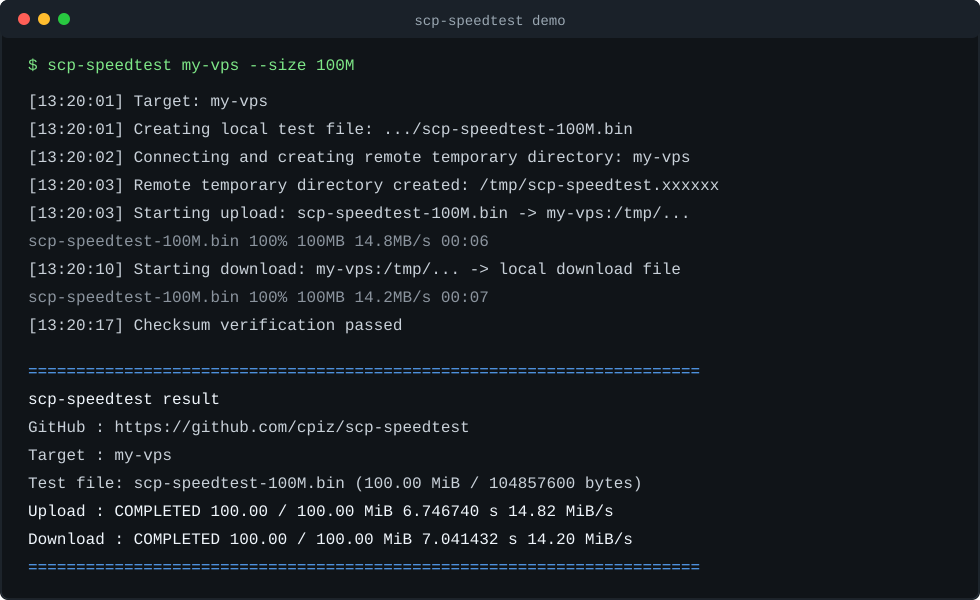

# scp-speedtest

[](https://github.com/cpiz/scp-speedtest/actions/workflows/ci.yml)
[](https://github.com/cpiz/scp-speedtest/releases)
[](LICENSE)
[](scp-speedtest.sh)

[English README](README.md)

一个使用 `scp` 做网络双向测速的 Bash 脚本。它会在本地和远端分别生成固定大小的测试文件：本地文件用于上传测速，远端文件用于下载测速，两个方向互不依赖。

默认测试文件大小为 `100M`。认证、密钥、跳板机、SSH config 等能力都交给系统自带的 `ssh/scp` 处理。

## 演示



原始录制文件提供为 asciinema cast：[docs/demo.cast](docs/demo.cast)。

## 快速开始

直接运行脚本会显示参数说明和示例：

```bash
./scp-speedtest.sh
```

```bash
chmod +x scp-speedtest.sh
./scp-speedtest.sh my-vps
```

其中 `my-vps` 可以是 `~/.ssh/config` 里的 Host alias，也可以是普通主机名。

临时试用时，也可以直接从 GitHub 拉取并执行：

```bash
curl -fsSL https://raw.githubusercontent.com/cpiz/scp-speedtest/v1.0.2/scp-speedtest.sh | bash -s -- my-vps
```

长期使用建议先下载脚本并审阅内容，再执行。
只有明确想使用最新开发版时，才建议把版本 tag 替换成 `main`。

等价的显式写法：

```bash
./scp-speedtest.sh --target my-vps
```

直接指定连接配置：

```bash
./scp-speedtest.sh --host 1.2.3.4 --user root --port 2222 --identity-file ~/.ssh/id_ed25519
```

指定更大的测试文件并输出 JSON：

```bash
./scp-speedtest.sh my-vps --size 1G --json
```

执行多轮测速并输出平均值：

```bash
./scp-speedtest.sh my-vps --rounds 3
```

## 安装

一行命令安装：

```bash
curl -fsSL https://raw.githubusercontent.com/cpiz/scp-speedtest/v1.0.2/install.sh | bash
```

安装到用户可写目录：

```bash
curl -fsSL https://raw.githubusercontent.com/cpiz/scp-speedtest/v1.0.2/install.sh | PREFIX="$HOME/.local" bash
```

直接安装到 `/usr/local/bin/scp-speedtest`：

```bash
sudo make install
```

指定安装路径：

```bash
make install PREFIX="$HOME/.local"
```

卸载：

```bash
sudo make uninstall
```

构建发布用 tarball：

```bash
make dist
```

## 常用参数

```text
./scp-speedtest.sh [alias-or-host] [options]

--target <alias-or-host>       SSH config Host alias or hostname; can also be passed as a positional argument
--host <host>                  Explicit SSH host or IP
--user <user>                  Explicit SSH user
--port <port>                  Explicit SSH port
--identity-file <path>         SSH private key path
--ssh-config <path>            SSH config file path
--jump-host <host>             ProxyJump / -J host
--connect-timeout <seconds>    SSH/SCP connection timeout in seconds
--max-duration <seconds>       Per-transfer timeout for upload and download
--rounds <count>               Number of test rounds, default 1
--ssh-option <Key=Value>       Extra ssh/scp -o option; can be repeated
--size <100M|1G>               Test file size, default 100M
--remote-dir <path>            Remote test directory, defaults to remote mktemp -d
--remote-file-method <method>  Remote file generator: auto, truncate, or dd
--legacy-scp                   Enable legacy scp protocol with scp -O
--json                         Print machine-readable JSON to stdout
--keep                         Keep temporary files for troubleshooting
--quiet                        Hide progress events and run scp in quiet mode
--show-ssh-warnings            Show ssh/scp security warnings that are suppressed by default
--dry-run                      Show resolved commands without running the test
-h, --help                     Show help
--version                      Show version
```

## 输出示例

普通输出：

```text
[13:20:01] Target: my-vps
[13:20:01] Creating local test file: /tmp/scp-speedtest.local.xxxxxx/scp-speedtest-100M.bin (100M / 104857600 bytes)
[13:20:01] Local test file created; calculating source checksum
[13:20:02] Connecting and creating remote temporary directory: my-vps
[13:20:02] Remote temporary directory created: /tmp/scp-speedtest.xxxxxx
[13:20:02] Starting upload: /tmp/scp-speedtest.local.xxxxxx/scp-speedtest-100M.bin -> my-vps:/tmp/scp-speedtest.xxxxxx/scp-speedtest-100M.bin
scp-speedtest-100M.bin                     100%  100MB  14.8MB/s   00:06
[13:20:09] Upload completed: 104857600 bytes, 6.746740 seconds, 14.82 MiB/s
[13:20:09] Preparing remote download test file: my-vps:/tmp/scp-speedtest.xxxxxx/scp-speedtest-100M.bin (100M / 104857600 bytes)
[13:20:09] Remote download test file ready
[13:20:09] Starting download: my-vps:/tmp/scp-speedtest.xxxxxx/scp-speedtest-100M.bin -> /tmp/scp-speedtest.local.xxxxxx/download/scp-speedtest-100M.bin
scp-speedtest-100M.bin                     100%  100MB  14.2MB/s   00:07
[13:20:16] Download completed: 104857600 bytes, 7.041432 seconds, 14.20 MiB/s
[13:20:16] Verifying downloaded file checksum
[13:20:16] Checksum verification passed
======================================================================
scp-speedtest result
GitHub   : https://github.com/cpiz/scp-speedtest
Target   : my-vps
Test file: scp-speedtest-100M.bin (100.00 MiB / 104857600 bytes)
----------------------------------------------------------------------
Upload   : COMPLETED       100.00 / 100.00    MiB    6.746740 s     14.82 MiB/s
Download : COMPLETED       100.00 / 100.00    MiB    7.041432 s     14.20 MiB/s
======================================================================
```

JSON 输出：

```json
{"ok":true,"version":"1.0.2","target":"my-vps","size":"100M","test_file":"scp-speedtest-100M.bin","bytes":104857600,"started_at":"2026-06-23T05:20:01Z","ended_at":"2026-06-23T05:20:16Z","remote_dir":"/tmp/scp-speedtest.xxxxxx","remote_generator":{"status":"completed","method":"truncate"},"upload":{"status":"completed","bytes":104857600,"seconds":6.746740,"mib_per_second":14.82},"download":{"status":"completed","bytes":104857600,"seconds":7.041432,"mib_per_second":14.20}}
```

稳定字段契约和 schema 见 [JSON Output Contract](docs/json-output.md)。

## 工作方式

1. 在本地临时目录生成指定大小的上传测试文件。
2. 使用 `ssh` 在远端创建临时目录，或使用 `--remote-dir` 指定的目录。
3. 在远端生成同样大小的下载测试文件。
4. 使用 `scp` 上传本地测试文件并计时。
5. 使用 `scp` 下载远端测试文件并计时。
6. 对完整下载文件做 SHA-256 checksum 校验。
7. 默认清理本地和远端临时文件。

checksum 校验不计入上传或下载耗时。

关键事件和 `scp` 自带进度输出写到 stderr；最终结果和 JSON 写到 stdout。需要安静运行时可以加 `--quiet`。

当本地 OpenSSH 客户端支持时，脚本默认会传入 `WarnWeakCrypto=no`，避免重复的 ssh/scp 安全提示刷屏。需要显示这些提示时，可以加 `--show-ssh-warnings`。

## 中断处理

传输过程中按 `Ctrl-C` 会中断当前 `scp` 阶段，但脚本会继续执行后续阶段并输出已收集的数据：

- 上传阶段中断：脚本会查询远端上传目标文件已写入大小，然后继续下载远端预先生成的完整测试文件。
- 下载阶段中断：脚本会读取本地已下载文件大小，并进入清理和结果输出。
- 下载未完整完成时，checksum 校验会跳过；如果只是上传中断但下载完整完成，仍会校验下载文件。
- 清理阶段仍会尽量删除本地临时目录、远端测试文件和远端临时目录。

部分传输输出示例：

```text
Upload: interrupted, 11534336 / 104857600 bytes, 21.000000 seconds, 0.52 MiB/s
Download: completed, 104857600 / 104857600 bytes, 9.500000 seconds, 10.53 MiB/s
```

## 多轮测速

使用 `--rounds <count>` 可以执行多轮同规格测速：

```bash
./scp-speedtest.sh my-vps --rounds 3
```

每一轮都会创建新的本地和远端临时文件，并在下一轮开始前完成清理。普通输出会打印每轮结果和最终 summary。summary 的平均速度只统计完整完成的轮次，因此中断或超时轮次会保留在结果里，但不会拉低已完成轮次的平均值。

JSON 输出中，单轮结果保持原来的扁平结构以维持兼容性；多轮结果会使用 `rounds` 数组和 `summary` 对象。

## 远端文件生成

下载测速需要在远端准备一个同等大小的文件。默认 `--remote-file-method auto` 会优先使用 `truncate`，不可用时回退到 `dd`。

如果你希望远端文件真实写满零字节，而不是稀疏文件，可以使用 `--remote-file-method dd`。这样更接近真实远端磁盘读取，但会增加下载测速开始前的准备时间。

如果你明确希望快速生成稀疏文件，并且远端没有 `truncate` 时直接失败，可以使用 `--remote-file-method truncate`。

## 结果如何解读

- 上传和下载可能差异很大，因为路由、云厂商出入站策略、CPU、加密算法和存储路径都可能不对称。
- `scp-speedtest` 测的是实际 `scp` 应用层吞吐，包含 SSH 加密和 `scp` 协议开销，因此通常会和 `iperf3` 不同。
- 中断或超时结果仍然有参考价值，适合判断链路是否明显过慢；结果里会显示已传输字节、耗时和中断前观测到的速度。
- 多轮平均值只统计完整完成的轮次；中断轮次仍会保留在每轮结果中。
- 如果下载明显慢于上传，可以尝试 `--remote-file-method dd`，避免稀疏远端文件影响对比。

## 准确性说明

这个工具测量的是 `scp` 实际应用层吞吐量，不是裸 TCP 带宽。结果会受到以下因素影响：

- SSH 加密算法和本地/远端 CPU。
- `scp` 当前使用的 SFTP 或 legacy scp 协议。
- 本地和远端磁盘/文件系统性能。
- 远端云厂商限速、QoS、跨境链路抖动。
- SSH config 中的 ProxyJump、ProxyCommand、IPQoS、Compression 等选项。

如果你需要纯网络链路上限，`iperf3` 更合适；如果你关心“真实 scp 文件传输体验”，这个工具更贴近实际。

## 注意事项

- 这个工具测的是 `scp` 实际传输吞吐量，不等同于裸网络带宽。
- 不支持在脚本中传入或保存密码；请使用 SSH agent、密钥、SSH config 或 `ssh/scp` 自身交互。
- 如果远端服务器只支持旧版 scp 协议，可以加 `--legacy-scp`。
- 如果需要检查命令拼装但不想连接远端，可以使用 `--dry-run`。
- 如果需要关闭中间事件和 `scp` 进度条，可以使用 `--quiet`。
- 如果链路很慢但不想手动中断，可以使用 `--max-duration <seconds>`。
- 如果远端稀疏文件可能让下载结果不够有代表性，可以使用 `--remote-file-method dd`。
- 运行时失败会输出最终失败卡片，包含目标、失败步骤、退出码和项目地址。

## 本地验证

```bash
make test
make lint
make format-check
```

等价的手动命令：

```bash
bash -n scp-speedtest.sh
bash -n tests/run_tests.sh
tests/run_tests.sh
```

如果本机安装了 `shellcheck`，可以额外运行：

```bash
shellcheck scp-speedtest.sh tests/run_tests.sh
```

## 开发与发布

- CI 覆盖 Ubuntu 和 macOS。
- 发布前更新 `CHANGELOG.md`。
- 版本号在 `scp-speedtest.sh` 顶部的 `VERSION` 中维护。
- 当前许可证为 MIT，见 `LICENSE`。

## 项目入口

- [贡献指南](CONTRIBUTING.md)
- [安全策略](SECURITY.md)
- [JSON 输出契约](docs/json-output.md)
